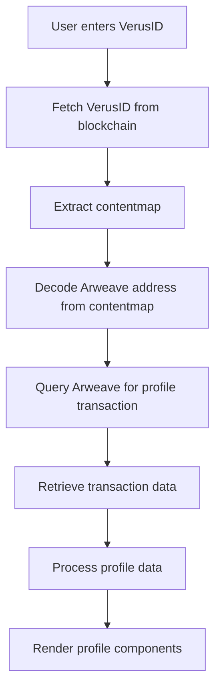

# VerusID Profile System: Complete Integration Guide

This comprehensive guide explains how the VerusID profile system works, from fetching a VerusID from the blockchain to displaying profile information from Arweave. This document details all necessary components for implementing a VerusID profile system in another website.

## Table of Contents

1. [System Overview](#system-overview)
2. [Data Flow](#data-flow)
3. [Core Components](#core-components)
   - [VerusID Retrieval](#verusid-retrieval)
   - [ContentMap Processing](#contentmap-processing)
   - [Arweave Integration](#arweave-integration)
   - [Profile Data Construction](#profile-data-construction)
4. [UI Components](#ui-components)
   - [Profile Main Components](#profile-main-components)
   - [Profile Section Components](#profile-section-components)
   - [Content Display Components](#content-display-components)
5. [VDXFID System](#vdxfid-system)
6. [Implementation Guide](#implementation-guide)
7. [API Reference](#api-reference)
8. [Dependencies](#dependencies)

## System Overview

The VerusID profile system retrieves and displays profile information stored on the Verus blockchain and Arweave network. The system works by:

1. Looking up a VerusID on the Verus blockchain
2. Extracting the contentmap from the VerusID data
3. Using the contentmap to find profile data on Arweave
4. Structuring the profile data for display
5. Rendering the profile using React components

## Data Flow



## Core Components

### VerusID Retrieval

#### File: `lib/VerusIdProfile/FetchVerusId.ts`

This component retrieves VerusID information from the Verus blockchain.

```typescript
import { VerusRPC } from '../VerusIdLogin/LoginConsentRequest'

interface Query {
  [key: string]: string | string[]
}

const FetchVerusId = async (query: Query) => {
  let result: Record<string, any> = {}

  try {
    result = await VerusRPC.interface.getIdentity(query.id as string)
  } catch (error) {
    return { result: null, error: { code: -5, message: 'network issue' } }
  }

  if (result?.result) {
    return { result: result.result, error: null }
  } else {
    return { result: null, error: result.error }
  }
}

export default FetchVerusId
```

#### File: `lib/VerusIdLogin/LoginConsentRequest.js`

Provides the RPC interface for blockchain communication.

### ContentMap Processing

#### File: `pages/verusid-lookup/[verusID].tsx`

This page component handles the VerusID lookup and initiates the profile data retrieval process:

```typescript
export const getServerSideProps: GetServerSideProps = async (ctx) => {
  let verusId = ctx.query.verusID

  if (verusId) {
    if (verusId.slice(-1) !== '@') {
      verusId = verusId + '@'
      // Redirect to proper format
      return {
        redirect: {
          destination: `/verusid-lookup/${verusId}`,
          permanent: true,
        },
      }
    }

    const profileData = await FetchVerusId({ id: verusId })
    if (profileData.result) {
      let data: VerusResult = {
        ...profileData,
        id: `${profileData.result.identity.name}@`,
      }

      const contentMap = profileData.result.identity.contentmap
      const profileJSON = await FetchVerusProfile(contentMap)
      
      if (profileJSON) {
        data = { ...data, profileJSON: profileJSON }
      }

      return { props: { data } }
    } else {
      return {
        redirect: {
          destination: `/verusid-lookup`,
          permanent: true,
        },
      }
    }
  } else {
    // Handle no ID provided
    return {
      redirect: {
        destination: `/verusid-lookup`,
        permanent: true,
      },
    }
  }
}
```

#### File: `lib/VerusIdProfile/FetchVerusProfile.ts`

Processes the contentmap to retrieve profile data from Arweave:

```typescript
import Arweave from 'arweave'
import {
  CreateProfile,
  FetchArweaveProfile,
  reverseHex,
} from '@/lib/VerusIdProfile'
import { PublicProfileProps } from './ProfileTypes'
import { CollectionsJSON, IdentityJSON } from '@/data/vdxfid'

const arConfig = {
  host: 'arweave.net',
  port: 443,
  protocol: 'https',
}
const arweave = Arweave.init(arConfig)

const FetchVerusProfile = async (content: Record<string, any>) => {
  // Check for arweave collection
  const arweaveVdxfid = CollectionsJSON.arweave.hash160result

  // Get Arweave transaction ID from the contentmap
  const arweaveTxId = await FetchArweaveProfile(
    content[arweaveVdxfid] || content[reverseHex(arweaveVdxfid)],
    IdentityJSON.public.vdxfid
  )

  if (arweaveTxId) {
    // Fetch the transaction data
    const arweaveJSON = await arweave.transactions
      .getData(arweaveTxId, {
        decode: true,
        string: true,
      })
      .then((res) => JSON.parse(res.toString()))

    if (arweaveJSON) {
      // Organize the profile data
      const profileJSON: PublicProfileProps = await CreateProfile(
        arweaveJSON[IdentityJSON.public.vdxfid]
      )

      return profileJSON
    }

    return null
  } else {
    return null
  }
}

export default FetchVerusProfile
```

### Arweave Integration

#### File: `lib/VerusIdProfile/FetchArweaveProfile.ts`

Converts the hex address to base64url and queries Arweave for the profile transaction:

```typescript
import { HexToBase64, isBase64url } from './Validators.js'

const endpoint = 'https://arweave.net/graphql'

const FetchArweaveProfile = async (tag: string, publicVdxfid: string) => {
  // Convert hex to base64url
  const address = HexToBase64(tag)

  if (isBase64url(address)) {
    // Create GraphQL query
    const queryStr = `query {
      transactions(
        first: 1
        sort: HEIGHT_DESC
        owners: ["${address}"]
        tags: { name: "${publicVdxfid}", values: ["1"] }
      ) {
        edges {
          node {
            id
            tags {
              name
              value
            }
          }
        }
      }
    }`
    
    // Execute query
    const result = await fetch(endpoint, {
      method: 'POST',
      headers: {
        'Content-Type': 'application/json',
        Accept: 'application/json',
      },
      body: JSON.stringify({ query: queryStr }),
    }).then((res) => res.json())

    // Return transaction ID if found
    if (result?.data?.transactions?.edges[0]?.node?.id) {
      const txId = result.data.transactions.edges[0].node.id
      return txId
    } else {
      return false
    }
  } else {
    return false
  }
}

export default FetchArweaveProfile
```

#### File: `lib/VerusIdProfile/Validators.js`

Contains utility functions including the critical `HexToBase64` conversion:

```javascript
import CryptoJS from 'crypto-js'

// More utility functions...

export const HexToBase64 = (hex) => {
  if (hex) {
    const hexDecoded = CryptoJS.enc.Hex.parse(hex)
    const base64 = CryptoJS.enc.Base64.stringify(hexDecoded)
    const base64url = base64
      .replace(/\+/g, '-')
      .replace(/\//g, '_')
      .replace(/=+/g, '')
    return base64url
  } else {
    return false
  }
}

export const reverseHex = (hex) => {
  return hex.match(/../g).reverse().join('')
}

// More utility functions...
```

#### File: `pages/api/arweaveContent.tsx`

API endpoint for fetching individual Arweave content items:

```typescript
import type { NextApiRequest, NextApiResponse } from 'next'
import Arweave from 'arweave'
import { serialize } from 'next-mdx-remote/serialize'
import { IdQuery } from '@/types/general'

const arConfig = {
  host: 'arweave.net',
  port: 443,
  protocol: 'https',
  logging: false,
}
const arweave = Arweave.init(arConfig)

export default async (req: NextApiRequest, res: NextApiResponse) => {
  const { id, type } = req.query as IdQuery

  try {
    const data = await arweave.transactions.getData(id.toString(), {
      decode: true,
      string: true,
    })
    if (type === 'post') {
      const result = await serialize(data.toString())
      res.statusCode = 200
      res.json(result)
    } else {
      res.statusCode = 200
      return data
    }
  } catch (error) {
    return error
  }
}
```

### Profile Data Construction

#### File: `lib/VerusIdProfile/CreateProfile.js`

Organizes the raw profile data into a structured format:

```javascript
import {
  CollectionsJSON,
  KeysJSON,
  IdentityJSON,
  ServicesJSON,
} from '@/data/vdxfid'

const CreateProfile = (profileJSON) => {
  let profile = {}
  try {
    // Process identity information
    for (const [key, value] of Object.entries(IdentityJSON)) {
      if (profileJSON[value.vdxfid]) {
        if (profile.public) {
          profile.public[key] = profileJSON[value.vdxfid]
        } else {
          profile.public = {}
          profile.public[key] = profileJSON[value.vdxfid]
        }
        delete profileJSON[value.vdxfid]
      }
    }
    
    // Process services
    for (const [key, value] of Object.entries(ServicesJSON)) {
      if (profileJSON[value.vdxfid]) {
        if (profile.services) {
          profile.services[key] = profileJSON[value.vdxfid]
        } else {
          profile.services = {}
          profile.services[key] = profileJSON[value.vdxfid]
        }
        delete profileJSON[value.vdxfid]
      }
    }
    
    // Process blockchain addresses
    for (const [key, value] of Object.entries(KeysJSON)) {
      if (profileJSON[value.vdxfid]) {
        if (profile.keys) {
          profile.keys[key] = profileJSON[value.vdxfid]
        } else {
          profile.keys = {}
          profile.keys[key] = profileJSON[value.vdxfid]
        }
        delete profileJSON[value.vdxfid]
      }
    }
    
    // Process collections
    for (const [key, value] of Object.entries(CollectionsJSON)) {
      if (profileJSON[value.vdxfid]) {
        if (profile.collections) {
          profile.collections[key] = profileJSON[value.vdxfid]
        } else {
          profile.collections = {}
          profile.collections[key] = profileJSON[value.vdxfid]
        }
        delete profileJSON[value.vdxfid]
      }
    }

    profileJSON = { ...profile }
    return profileJSON
  } catch (error) {
    console.error(error)
    return profile
  }
}

export default CreateProfile
```

## UI Components

### Profile Main Components

#### File: `components/sections/VerusId/Profile.tsx`

The main profile component that orchestrates rendering all profile sections:

```typescript
import { useContext } from 'react'
import {
  ProfileServices,
  ProfileAccounts,
  ProfileCollections,
} from './VerusIdProfile'
import { VerusIDContext } from '@/lib/Contexts'

const Profile = () => {
  const context = useContext(VerusIDContext)
  const profile = context?.profileJSON
  
  if (profile) {
    return (
      <>
        {profile?.services && <ProfileServices />}
        {profile?.keys && <ProfileAccounts />}
        {profile?.collections && <ProfileCollections />}
      </>
    )
  } else {
    return null
  }
}

export default Profile
```

#### File: `components/sections/VerusId/ProfileHeader.tsx`

Renders the profile header with avatar and background:

```typescript
import styled from 'styled-components'
import { DefaultHeader } from '@/components/elements'

const StyledHeader = styled.div<any>`
  width: 100%;
  min-height: 175px;
  box-shadow: 0 4px 8px 0 rgba(0, 0, 0, 0.2), 0 6px 20px 0 rgba(0, 0, 0, 0.19);
  background-image: url(${(props) => props.header});
  background-position: center bottom;
  background-size: cover;
  background-repeat: no-repeat;
  margin-bottom: ${(props) => (props.avatar && '80px') || '32px'};
  border-top-left-radius: 8px;
  border-top-right-radius: 8px;
`

const StyledAvatar = styled.div<any>`
  margin: 32px;
  height: 160px;
  width: 160px;
  border-radius: 50%;
  background-image: url(${(props) => props.avatar});
  background-position: center center;
  background-size: cover;
  background-repeat: no-repeat;
  box-shadow: 0 4px 8px 0 rgba(0, 0, 0, 0.2), 0 6px 20px 0 rgba(0, 0, 0, 0.19);
  ${(props) =>
    props.header &&
    `
  position: relative;
  bottom: -90px;
  right: -32px;
  margin:0;
  `}
`

const ProfileHeader = ({
  profileHeader,
  verusId,
}: {
  profileHeader: Record<string, any>
  verusId: string
}) => {
  const avatar = profileHeader?.avatar
  const header = profileHeader?.header
  const about = profileHeader?.about

  return (
    <>
      {header ? (
        <StyledHeader header={header.image} avatar={avatar}>
          {avatar && (
            <StyledAvatar avatar={avatar.image} header={header} />
          )}
        </StyledHeader>
      ) : avatar ? (
        <StyledAvatar avatar={avatar.image} header={header} />
      ) : null}

      <StyledContent heading={avatar || header}>
        <DefaultHeader as="h3" align="left">
          {verusId}
        </DefaultHeader>
      </StyledContent>
      
      {about ? (
        <StyledContent heading={true}>
          <DefaultHeader as="h5" align="left">
            {about.text}
          </DefaultHeader>
        </StyledContent>
      ) : null}
    </>
  )
}

export default ProfileHeader
```

### Profile Section Components

#### File: `components/sections/VerusId/VerusIdProfile/ProfileServices.tsx`

Renders the services section (social media, websites):

```typescript
import { useContext } from 'react'
import { VerusIDContext } from '@/lib/Contexts'
import ServiceCard from './ServiceCard'
import { StyledContainer } from './ProfileStyles'

const ProfileServices = () => {
  const context = useContext(VerusIDContext)
  const services = context.profileJSON.services
  
  return (
    <StyledContainer>
      {Object.keys(services).map((item, index) => (
        <ServiceCard
          type={item}
          key={`${item}_${index}`}
          serviceAccount={services[item]}
        />
      ))}
    </StyledContainer>
  )
}

export default ProfileServices
```

#### File: `components/sections/VerusId/VerusIdProfile/ProfileAccounts.tsx`

Renders blockchain account information:

```typescript
import { useContext } from 'react'
import { VerusIDContext } from '@/lib/Contexts'
import { StyledContainer } from './ProfileStyles'
import AccountCard from './AccountCard'

const ProfileAccounts = () => {
  const context = useContext(VerusIDContext)
  const accounts = context.profileJSON.keys

  return (
    <StyledContainer>
      {Object.keys(accounts).map((account, index) => (
        <AccountCard
          key={`${account}_${index}`}
          type={account.toString().split('.')[0]}
          account={accounts[account]}
        />
      ))}
    </StyledContainer>
  )
}

export default ProfileAccounts
```

#### File: `components/sections/VerusId/VerusIdProfile/ProfileCollections.tsx`

Manages profile content collections:

```typescript
import { useContext } from 'react'
import { VerusIDContext } from '@/lib/Contexts'
import { StyledContainer } from './ProfileStyles'
import ProfileContent from './ProfileContent'

const ProfileCollections = () => {
  const context = useContext(VerusIDContext)
  const collectionsContent = context.profileJSON.collections?.content

  return (
    <StyledContainer>
      {collectionsContent && (
        <ProfileContent profileContent={collectionsContent} />
      )}
    </StyledContainer>
  )
}

export default ProfileCollections
```

### Content Display Components

#### File: `components/sections/VerusId/VerusIdProfile/ProfileContent.tsx`

Routes content to appropriate display components based on type:

```typescript
import styled from 'styled-components'
import { PublicProfileLib } from '@/lib/VerusIdProfile/ProfileTypes'
import WebContent from './WebContent'
import ArweaveContent from './ArweaveContent'
import GroupContent from '@/lib/VerusIdProfile/GroupContent'

const StyledContainer = styled.div`
  display: flex;
  flex-direction: column;
  width: 100%;

  margin: 0 0 35px;
  border: solid 1px rgba(0, 0, 0, 0.125);
  border-radius: 8px;
  padding: 10px;
  justify-content: center;
  button {
    justify-content: center;
  }
`

const StyledPostContent = styled.div<any>`
  ${(props) =>
    !props.readStatus &&
    `
  display: -webkit-box;
  -webkit-line-clamp: 10;
  -webkit-box-orient: vertical;
  overflow-y: hidden;
  `}
  pre {
    background: black;
    color: white;
    overflow-x: auto;
    padding: 4px 10px;
  }
  img {
    width: 100%;
    height: auto;
  }

  a {
    color: #3165d4;
  }
`

const fetcher = (url: string) => fetch(url).then((res) => res.json())

const ArweaveContent = ({ content }: { content: PublicProfileLib }) => {
  const [readMore, setReadMore] = useState(false)
  const { data, error } = useSWR(
    `/api/arweaveContent?id=${content.txid}&type=${content.type}`,
    fetcher
  )
  if (error) return <div>Failed to load content</div>
  if (!data) return <div>Fetching content from arweave...</div>

  switch (content.type) {
    case 'post':
      return (
        <StyledContainer>
          <StyledPostContent readStatus={readMore}>
            <MDXRemote {...data} components={ArweaveComponents} />
          </StyledPostContent>
          {data.compiledSource.length > 1700 && (
            <Button
              onClick={() => setReadMore(!readMore)}
              fontRegular
              small
              margin="8px 0 0 0 "
            >
              {readMore ? 'Read Less' : 'Read More'}
            </Button>
          )}
        </StyledContainer>
      )
    default:
      return (
        <>
          <p>unknown</p>
          <p>{content.type}</p>
        </>
      )
  }
}

export default ArweaveContent
```

#### File: `components/sections/VerusId/VerusIdProfile/WebContent.tsx`

Displays web-based content:

```typescript
import styled from 'styled-components'
import { PublicProfileLib } from '@/lib/VerusIdProfile/ProfileTypes'
import { DefaultText, DefaultLink } from '@/components/elements'

const StyledImages = styled(DefaultText)`
  border: solid 1px rgba(0, 0, 0, 0.125);
  border-radius: 8px;
  padding: 8px;
  width: fit-content;
`

const StyledIframeContainer = styled.div`
  width: 100%;
`

const WebContent = ({ content }: { content: PublicProfileLib }) => {
  switch (content.type) {
    case 'text':
      // Check if contains iframe or HTML
      if (content.text.toString().includes('iframe')) {
        return (
          <StyledIframeContainer
            dangerouslySetInnerHTML={{ __html: content.text.toString() }}
          />
        )
      } else if (content.text.toString()[0] === '<') {
        // Found HTML beginning tag
        return (
          <StyledIframeContainer
            dangerouslySetInnerHTML={{ __html: content.text.toString() }}
          />
        )
      } else {
        return <DefaultText>{content.text.toString()}</DefaultText>
      }

    case 'pre':
      return <DefaultText as="pre">{content.text.toString()}</DefaultText>
      
    case 'image':
      return (
        <StyledImages>
          
        </StyledImages>
      )
      
    case 'url':
      if (content.url.toString().includes('http')) {
        return (
          <DefaultLink
            customColor="blue"
            external
            href={content.url.toString()}
          >
            {content.name.toString()}
          </DefaultLink>
        )
      } else {
        return (
          <div>
            Sorry, unable to process {content.type} content to display for{' '}
            {content.name}
          </div>
        )
      }
      
    default:
      if (content.name) {
        return (
          <div>
            Sorry, unable to process {content.type} content to display for{' '}
            {content.name}
          </div>
        )
      } else {
        return <div>Sorry, unable to process content to display</div>
      }
  }
}

export default WebContent
```

## VDXFID System

The VDXFID system is a standardized way to reference different types of content and identity information. The system uses unique identifiers for each type of data.

### File: `data/vdxfid/index.ts`

Central export of all VDXFID collections:

```typescript
import CollectionsJSON from './collectionsJSON'
import KeysJSON from './keysJSON'
import IdentityJSON from './identityJSON'
import ServicesJSON from './servicesJSON'
import ProofsJSON from './proofsJSON'

export { CollectionsJSON, KeysJSON, IdentityJSON, ServicesJSON, ProofsJSON }
```

### File: `data/vdxfid/collectionsJSON.ts`

Maps content collections to their VDXF identifiers:

```typescript
import { VDXFID } from '@/lib/VerusIdProfile'

const CollectionsJSON: Record<string, VDXFID> = {
  arweave: {
    vdxfid: 'iCS9VrxGjNsHUhrVqkV17Ws66cmg5rZecV',
    hash160result: 'cf19fddae8aa266c8d0d4807196681666cfd4562',
    qualifiedname: {
      namespace: 'i5w5MuNik5NtLcYmNzcvaoixooEebB6MGV',
      name: 'vrsc::system.collections.arweave',
    },
  },
  content: {
    vdxfid: 'iSYgqLigKLF62dLypvQV4pCCanJyqyRQ2F',
    hash160result: '8bb751d39d2df2261d9502cff3315fad8e6714fd',
    qualifiedname: {
      namespace: 'i5w5MuNik5NtLcYmNzcvaoixooEebB6MGV',
      name: 'vrsc::system.collections.content',
    },
  },
  web: {
    vdxfid: 'i49LxHRkUqiJjbL5hTrUUzo4PWUGVfm421',
    hash160result: 'e0d65ebc27911679ed5f4a6828c0f8d294795707',
    qualifiedname: {
      namespace: 'i5w5MuNik5NtLcYmNzcvaoixooEebB6MGV',
      name: 'vrsc::system.collections.web',
    },
  },
  // Additional content types...
  'web.text': {
    vdxfid: 'iSbxi18bWUYMnMmFKpgZAZgu62uv7WEC4e',
    hash160result: '1e823fe4976c5194d7b3f188b6d4d62e26e7b2fd',
    qualifiedname: {
      namespace: 'i5w5MuNik5NtLcYmNzcvaoixooEebB6MGV',
      name: 'vrsc::system.collections.content.web.text',
    },
  },
  'web.pre': {
    vdxfid: 'i7yXtWCauSpcxwpwavyMseQxTRh2WNfNtT',
    hash160result: '5649834be747fe60f4f6f3c7bfe59a1646f25c31',
    qualifiedname: {
      namespace: 'i5w5MuNik5NtLcYmNzcvaoixooEebB6MGV',
      name: 'vrsc::system.collections.content.web.pre',
    },
  },
  'web.url': {
    vdxfid: 'iRYGy6HyYW1qoZk9hAkFwDs7RygBRUsswW',
    hash160result: '342df5c6bf429d9d4682c6388c9c54b7295b08f2',
    qualifiedname: {
      namespace: 'i5w5MuNik5NtLcYmNzcvaoixooEebB6MGV',
      name: 'vrsc::system.collections.content.web.url',
    },
  },
  // More content types...
}

export default CollectionsJSON
```

### File: `data/vdxfid/identityJSON.ts`

Maps profile identity elements to their VDXF identifiers:

```typescript
import { VDXFID } from '@/lib/VerusIdProfile'

const IdentityJSON: Record<string, VDXFID> = {
  public: {
    vdxfid: 'iEXZ3nd4K9fmGDSiQ8J6XLATzUUSKp1eAz',
    hash160result: 'a2ef87a471b4e479f33a3e7dca0fd51bf0fa3b79',
    qualifiedname: {
      namespace: 'i5w5MuNik5NtLcYmNzcvaoixooEebB6MGV',
      name: 'vrsc::system.identity.profile.public',
    },
  },
  avatar: {
    vdxfid: 'iMMRVtGBNkr7V2hUNd4LLFiPQyzGrxAhx1',
    hash160result: 'abfd564535a395d94002eb621080bec70c661ac4',
    qualifiedname: {
      namespace: 'i5w5MuNik5NtLcYmNzcvaoixooEebB6MGV',
      name: 'vrsc::system.identity.profile.avatar',
    },
  },
  // More identity elements...
}

export default IdentityJSON
```

### File: `data/vdxfid/keysJSON.ts`

Maps blockchain addresses to their VDXF identifiers:

```typescript
import { VDXFID } from '@/lib/VerusIdProfile'

const KeysJSON: Record<string, VDXFID> = {
  'vrsc.address': {
    vdxfid: 'iD55EMBMDaeoBCBp8HqNebxK92aABKicT8',
    hash160result: '6aaee08976c5ce8e3060f9ebb6b3dc9376d14169',
    qualifiedname: {
      namespace: 'i5w5MuNik5NtLcYmNzcvaoixooEebB6MGV',
      name: 'vrsc::system.keys.vrsc.address',
    },
  },
  'vrsc.identity': {
    vdxfid: 'iRjhBnikFiZummQRxbtP3FexLemVoxzgWa',
    hash160result: '9c300dcfc398a322921ac9fa7d15b3b80b2631f4',
    qualifiedname: {
      namespace: 'i5w5MuNik5NtLcYmNzcvaoixooEebB6MGV',
      name: 'vrsc::system.keys.vrsc.identity',
    },
  },
  // More blockchain addresses...
}

export default KeysJSON
```

### File: `data/vdxfid/servicesJSON.ts`

Maps service accounts to their VDXF identifiers:

```typescript
import { VDXFID } from '@/lib/VerusIdProfile'

const ServicesJSON: Record<string, VDXFID> = {
  discord: {
    vdxfid: 'i7aKFqemraKTTjmnuxMTAL6LNnYSUKq9J4',
    hash160result: 'c1d7f27cdd8f88504017155424345217a0d5f82c',
    qualifiedname: {
      namespace: 'i5w5MuNik5NtLcYmNzcvaoixooEebB6MGV',
      name: 'vrsc::system.services.accounts.discord',
    },
  },
  twitter: {
    vdxfid: 'i7FchM7um32xFYs1jMLHk3SaYYjCSiE9bD',
    hash160result: 'a55fd61f188a6f2a773bf03ebef621ae3c7d6f29',
    qualifiedname: {
      namespace: 'i5w5MuNik5NtLcYmNzcvaoixooEebB6MGV',
      name: 'vrsc::system.services.accounts.twitter',
    },
  },
  // More service accounts...
}

export default ServicesJSON
```

## Implementation Guide

To implement the VerusID profile system in another website, follow these steps:

### 1. Set Up Dependencies

Required npm packages:

```bash
npm install arweave crypto-js next-mdx-remote styled-components swr
```

### 2. Implement Core Logic

#### Step 1: Fetch VerusID from blockchain

Create a function to fetch VerusID data from the Verus blockchain RPC interface:

```javascript
async function fetchVerusId(id) {
  // Add your RPC connection details
  const result = await rpcInterface.getIdentity(id);
  
  if (result?.result) {
    return { result: result.result, error: null };
  } else {
    return { result: null, error: result.error };
  }
}
```

#### Step 2: Extract and process contentmap

```javascript
function processContentMap(contentMap) {
  // Get the arweave collection hash
  const arweaveVdxfid = 'cf19fddae8aa266c8d0d4807196681666cfd4562';
  const reversedHex = reverseHex(arweaveVdxfid);
  
  // Get the value from contentmap (prefer direct, then try reversed)
  const arweaveHexValue = contentMap[arweaveVdxfid] || contentMap[reversedHex];
  
  // Convert hex to base64url
  const arweaveAddress = hexToBase64(arweaveHexValue);
  
  return arweaveAddress;
}

function reverseHex(hex) {
  return hex.match(/../g).reverse().join('');
}

function hexToBase64(hex) {
  // Using browser APIs or crypto-js
  const hexDecoded = CryptoJS.enc.Hex.parse(hex);
  const base64 = CryptoJS.enc.Base64.stringify(hexDecoded);
  const base64url = base64
    .replace(/\+/g, '-')
    .replace(/\//g, '_')
    .replace(/=+/g, '');
  return base64url;
}
```

#### Step 3: Query Arweave for profile transaction

```javascript
async function fetchArweaveProfile(arweaveAddress, publicVdxfid) {
  const endpoint = 'https://arweave.net/graphql';
  const queryStr = `query {
    transactions(
      first: 1
      sort: HEIGHT_DESC
      owners: ["${arweaveAddress}"]
      tags: { name: "${publicVdxfid}", values: ["1"] }
    ) {
      edges {
        node {
          id
          tags {
            name
            value
          }
        }
      }
    }
  }`;
  
  const result = await fetch(endpoint, {
    method: 'POST',
    headers: {
      'Content-Type': 'application/json',
      'Accept': 'application/json',
    },
    body: JSON.stringify({ query: queryStr }),
  }).then(res => res.json());
  
  if (result?.data?.transactions?.edges[0]?.node?.id) {
    return result.data.transactions.edges[0].node.id;
  } else {
    return null;
  }
}
```

#### Step 4: Fetch transaction data

```javascript
async function fetchTransactionData(txId) {
  // Initialize Arweave client
  const arweave = Arweave.init({
    host: 'arweave.net',
    port: 443,
    protocol: 'https',
  });
  
  try {
    const data = await arweave.transactions.getData(txId, {
      decode: true,
      string: true,
    });
    
    return JSON.parse(data);
  } catch (error) {
    console.error('Error fetching transaction:', error);
    return null;
  }
}
```

#### Step 5: Organize profile data

```javascript
function organizeProfileData(rawData, publicVdxfid) {
  // Extract profile data using the public VDXFID
  const profileData = rawData[publicVdxfid];
  
  // Create empty profile structure
  const profile = {
    public: {},
    services: {},
    keys: {},
    collections: {}
  };
  
  // Map through different VDXF keys and organize data
  // This would need to be customized based on the VDXF keys you want to support
  
  return profile;
}
```

### 3. Create UI Components

Build React components to display the profile data, following the structure outlined in the UI Components section.

### 4. Putting It All Together

```javascript
async function loadVerusIdProfile(verusId) {
  // Step 1: Fetch VerusID
  const verusIdData = await fetchVerusId(verusId);
  
  if (verusIdData.result) {
    // Step 2: Process contentmap
    const contentMap = verusIdData.result.identity.contentmap;
    const arweaveAddress = processContentMap(contentMap);
    
    // Step 3: Find profile transaction
    const publicVdxfid = 'iEXZ3nd4K9fmGDSiQ8J6XLATzUUSKp1eAz'; // Public profile VDXFID
    const txId = await fetchArweaveProfile(arweaveAddress, publicVdxfid);
    
    if (txId) {
      // Step 4: Fetch transaction data
      const transactionData = await fetchTransactionData(txId);
      
      if (transactionData) {
        // Step 5: Organize profile data
        const profileData = organizeProfileData(transactionData, publicVdxfid);
        
        return {
          verusId: verusId,
          profileData: profileData
        };
      }
    }
  }
  
  return null;
}
```

## API Reference

### VerusID API

- `FetchVerusId(query)`: Fetches VerusID data from the blockchain
- `FetchVerusProfile(contentMap)`: Processes the contentmap to retrieve profile data
- `FetchArweaveProfile(tag, publicVdxfid)`: Finds the Arweave transaction containing profile data
- `CreateProfile(profileJSON)`: Organizes raw profile data into a structured format

### Arweave API

- `arweave.transactions.getData(txId, options)`: Retrieves transaction data
- GraphQL endpoint: `https://arweave.net/graphql`

### Utility Functions

- `HexToBase64(hex)`: Converts a hex string to base64url format
- `reverseHex(hex)`: Reverses the byte order of a hex string
- `isBase64url(str)`: Checks if a string is in base64url format

## Dependencies

- **arweave**: For interacting with the Arweave network
- **crypto-js**: For cryptographic operations
- **next-mdx-remote**: For rendering MDX content
- **styled-components**: For component styling
- **swr**: For data fetching and caching

---

This guide provides a comprehensive explanation of the VerusID profile system, from data retrieval to UI rendering. By following the implementation steps and referencing the provided code examples, you can integrate VerusID profiles into any web application.
